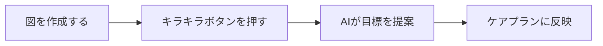

# アローチャートアプリ 取扱説明書
〜 思考を可視化し、より良いケアを実現するために 〜

## 1. はじめに
このアプリは、医療・介護の現場で「なぜその困りごとが起きているのか？」という思考過程を、簡単な図（アローチャート）で整理するためのツールです。
図を作ることで、本人や家族の「想い」と、専門職が見た「事実」を整理し、AIが最適なケアの目標を提案してくれます。

---

## 2. 基本の「カード」を知る
アプリでは、2種類のカードを使って考えを整理します。

| カードの種類 | 形 | 意味 | 例 |
| :--- | :---: | :--- | :--- |
| **主観的事実** | **□ (四角)** | 本人や家族の言葉、感情、希望 | 「外に出たい」「足が痛い」 |
| **客観的事実** | **○ (円)** | 専門的な事実、診断、環境、状態 | 「膝の変形」「段差がある」 |

---

## 3. 基本操作：カードを置く・書く
操作はとてもシンプルです。

### 3.1 カードを置く
1. 画面下の**道具箱（ツールバー）**から、置きたい形（○か□）を選びます。
2. 画面の好きな場所を**ポンと叩く（タップ）**と、カードが現れます。

### 3.2 文字を入力する
1. 置いたカードを**素早く2回叩く（ダブルタップ）**と、文字入力画面が開きます。
2. 文字を入れて「保存」ボタンを押してください。

### 3.3 動かす・大きさを変える
- **動かす**: カードを指で押さえたまま動かします。
- **大きくする**: カードの右下や端っこを指で引っ張ります。

---

## 4. 応用：考えをつなぐ（線を引く）
カード同士を線でつなぐことで、原因と結果が見えてきます。

### 4.1 線の種類
- **順接 (→)**: 「AだからB」という自然な流れ。
- **逆説 (zigzag)**: 「AだけどB」という困りごとやギャップ。
- **意味づけ (─)**: 普段の価値観や背景。

### 4.2 線の引き方
1. ツールバーから**引きたい線の種類**を選びます。
2. **出発点**（原因となるカード）をタップします。
3. **終着点**（結果となるカード）をタップします。
これだけで矢印が引けます。

---

## 5. AI：目標を自動で作る
図が完成したら、AIに相談してみましょう。

1. 画面右上の**「キラキラしたボタン（AI提案）」**を押します。
2. 少し待つと、図の中から「短期目標」と「長期目標」をAIが自動で見つけ出して提案してくれます。
3. 提案された内容はそのままケアプランの参考にできます。

---

## 6. 保存と印刷
作成したチャートは大切に保存しましょう。

- **保存**: 画面右上のメニューから保存できます（自動保存も行われます）。
- **PDFで出す**: 画面右上の「PDF」ボタンを押すと、印刷したり、他の人に配布しやすい形式で保存できます。
- **画像で出す**: 「画像」ボタンを押すと、写真として保存し、報告書などに貼り付けることができます。

---

## 7. オフライン利用（インターネットなしでの操作）
このアプリは「訪問先など、電波がない場所」でも使えるように設計されています。

- **オフライン（圏外）でできること**:
  - カードを置く、文字を書く、線を引くといった**すべての図の作成・保存機能**
  - 作成した図の**PDFや画像での出力**
- **オンライン（ネット接続）が必要なこと**:
  - **「AIへの目標提案の依頼」**（✨ボタンの機能）

訪問先では「まずは話を聞きながら図を作り、保存する」ことに専念いただき、事務所やWi-Fiのある環境に戻ってからAIに目標を提案してもらう、という使い方が最も効率的です。

---

## よくある質問 (FAQ)
- **Q: 間違えて線を引いてしまった！**
  - A: 消したい線を指で**素早く2回叩く（ダブルタップ）**と、削除メニューが出ます。
- **Q: 線を枝分かれさせたい。**
  - A: 逆説（ギザギザ）や意味づけ（直線）の**線の真ん中付近**をタップしてください。新しい出発点が生まれます。

---
制作：AXLINK (Developer) / 原案・監修：吉島 豊録 (Author)
